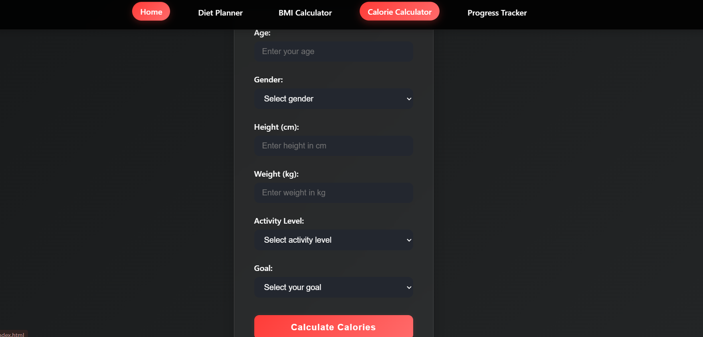

# 🏋️‍♂️ Fitness Pro – Workout Helper

A modern, interactive fitness web app to help you plan workouts, track progress, calculate BMI & calories, and get personalized diet plans. Built with a focus on design, usability, and smart engineering using AI tools like Deepseek , Claude and ChatGPT.

---

## 🚀 Features

- **Home:** Explore exercises by body part with video tutorials
- **Diet Planner:** Get personalized meal plans (veg, non-veg, both)
- **BMI Calculator:** Instantly check your BMI and health category
- **Calorie Calculator:** Estimate daily calorie needs based on your stats and goals
- **Progress Tracker:** Log workouts, view streaks, and see your progress visually
- **Responsive Design:** Looks great on all devices
- **Modern UI:** Dark gym-inspired theme, smooth animations, and accessibility

---

## 📸 Screenshots

### Home Page


### BMI Calculator


### Calorie Calculator


### Progress Tracker


---

## 🛠️ Skills Demonstrated

- **HTML5, CSS3, JavaScript (ES6+)**
- **Responsive & accessible web design**
- **UI/UX best practices**
- **Prompt engineering for AI-assisted coding**
- **Use of Deepseek, Claude and ChatGPT for rapid prototyping and code review**
- **LocalStorage for persistent progress tracking**
- **Semantic HTML & ARIA for accessibility**
- **Modern CSS (variables, gradients, dark mode)**

---

## 💻 Getting Started

1. **Clone the repo:**
   ```bash
   git clone https://github.com/Harsh-KH-6/fitness-pro-workout-helper.git
   cd fitness-pro-workout-helper
   ```
2. **Run locally:**
   ```bash
   # For Python 3.x
   python -m http.server 8000
   # Then open http://localhost:8000 in your browser
   ```
3. **No build step needed!**

---

## 🤝 Connect With Me

- **Email:** [harsh06pb@gmail.com](mailto:harsh06pb@gmail.com)
- **LinkedIn:** (https://linkedin.com/in/khharsh)
- **GitHub:** [Harsh-KH-6](https://github.com/Harsh-KH-6)

---

## 🙌 Contributing

Contributions, suggestions, and feedback are welcome! Feel free to fork this repo, open issues, or submit pull requests. Let’s make fitness smarter together.

---
